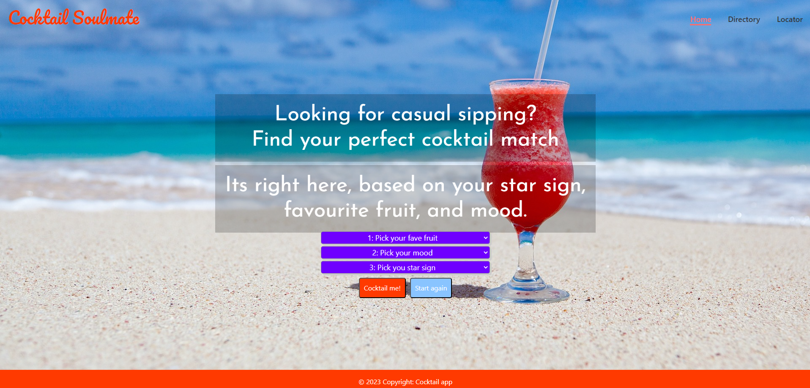
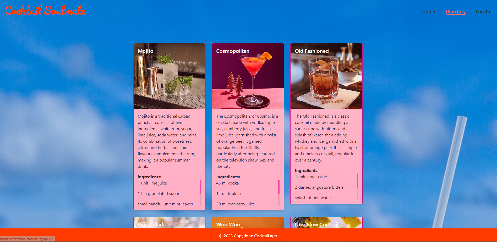
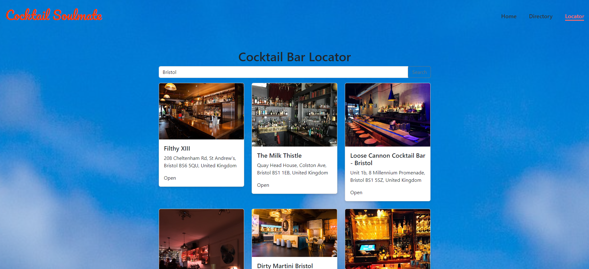

# Cocktail Soulmate

 ## Table of Contents:
 * [Description](#Description)  
 * [Usage](#Usage)
 * [Installation](#Installation)
 * [License](#License)
 * [Contributing](#Contributing)
 * [Questions](#Questions)
        

## <a id="Description">Description:</a>

### Project Overview
The Cocktail App React project is a single-page web application built using React, a popular JavaScript library for building user interfaces. The app provides a directory of cocktail recipes, as well as a cocktail bar locator. Users can browse cocktail recipes and learn how to make their favorite drinks, or search for cocktail bars in their area.

### Technologies Used
The app uses a number of external npm packages to provide additional functionality. These include axios for making HTTP requests, bootstrap and react-bootstrap for styling and layout, cors for enabling Cross-Origin Resource Sharing, and express for creating a proxy server to interact with external APIs. Additionally, react-router-dom is used to enable client-side routing, and react-reveal and react-typed are used for animation and typing effects, respectively.
### Development Process
This project was developed by a team of three developers using Git and GitHub for version control. We followed an agile development methodology and worked on features independently before merging them into the main branch.

### Purpose and Target Audience
Overall, the Cocktail App React project is a useful tool for anyone who wants to learn more about making cocktails or finding cocktail bars in their area. With its clean and responsive design, intuitive user interface, and comprehensive directory of cocktail recipes, the app is a great for anyone looking to experiment with their next alchohilic beverage. 

        

## <a id="Usage">Usage:</a>

Access the live deployed application at: https://cocktailsoulmate.netlify.app/#/

To use the app, simply navigate to the homepage where you can answer three questions to determine the right cocktail for you. The cocktail card will provide you with more information about that drink, including a detailed list of ingredients. Alternatively, you can use the directory page to find our complete range of cocktails. Finally, if you're looking to go out and enjoy a drink in person, you can use the locator page to find cocktail bars in your area. Simply enter your location and click the "Search" button to view a list of nearby bars, complete with address, opening hours, and an image of the establishment. 
## <a id="Installation">Installation:</a>

To install and run the Cocktail App in a development environment, follow these steps:

1. Clone the project from the GitHub repository.
2. Open the project in your preferred code editor.
3. Run `npm install` in the project directory to install the necessary dependencies.
4. Replace the API key used in the project and add your own Google Places API key in the Locator directory as well as the proxy-server.js file.
5. Start the development server with `npm run dev`, this will run both `npm start` and `node proxy-server.js` simultaneously using the npm package Concurrently.
6. Open a web browser and navigate to `http://localhost:3000` to view the app in action.

With these steps completed, you will be able to run the Cocktail App React on your local machine and explore the different features and functionalities of the app.

## <a id="License">License:</a>

This project is licensed by the Creative-Commons license. 

## <a id="Contributing">Contributing:</a>

We welcome contributions to this project! If you are interested in contributing, please contact us via GitHub. We would love to hear from you and discuss potential ways to collaborate. Some ways you can contribute include fixing bugs, adding features, improving documentation, and writing tests. Please note that this project is released with a Creative Commons License, so all contributions must also be licensed under the same terms. We appreciate your interest in this project and look forward to hearing from you!

## <a id="Questions">Questions:</a>
For any questions, please reach out to any of the team that worked on this project via any of the channels listed below!

* Github: My username is harrygarstang, avaliable at https://github.com/harrygarstang
* Email: Alternatively, you can email me at harrygarstang2@gmail.com

* Github: My username is helenesauve, avaliable at https://github.com/helenesauve
* Email: Alternatively, you can email me at helenecatherinesauve@gmail.com

* Github: My username is helenesauve, avaliable at https://github.com/inaciobanu
* Email: Alternatively, you can email me at cati_ciobanu@yahoo.com

